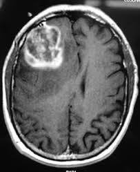
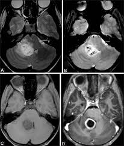
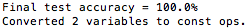
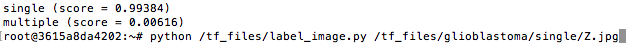
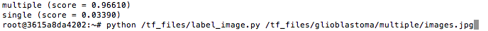

# Tensorflow Multiple Scan vs. Single Scan MRI Image Classifier

Use this classifier to label images taken with Magnetic Resonance Imaging (MRI) that are either a single scan or a tile of multiple scans. TensorFlow for Poets: [CodeLab](https://codelabs.developers.google.com/codelabs/tensorflow-for-poets/?utm_campaign=chrome_series_machinelearning_063016&utm_source=gdev&utm_medium=yt-desc#0)

##Requirements

* [docker](https://www.docker.com/products/docker-toolbox)

##Usage 

1. Start the docker image `docker run -it -v ~/projects/dump/tf_files/:/tf_files/ gcr.io/tensorflow/tensorflow:latest-devel`
2. Run the label_image script to label the image. `python /tf_files/label_image.py <path_to_file>`

##Results

###Accuracy

###Single MRI Scan Image Test

###Multiple MRI Scan Image Test

